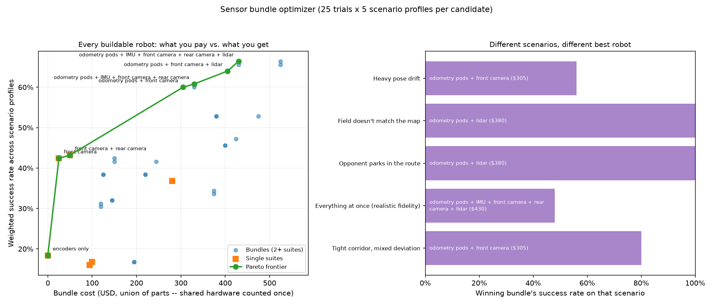

# autonomous-nav

[](https://github.com/k-mma/autonomous-nav/actions/workflows/tests.yml)

Research question: which sensing investment actually buys reliability
in a 30-second FTC (*FIRST* Tech Challenge) autonomous period, and at
what level of field/reality deviation does each one become necessary?


The finding: Odometry pods (~$195) has the highest raw success rate --
FullSuite (distance sensors + AprilTag + odometry, ~$315) isn't even
the runner-up anymore -- but AprilTag alone (~$25, a single Logitech
C270) delivers 32 times FullSuite's success-rate gain per dollar
spent over the free dead-reckoning baseline -- and the most useful
result is negative: DistanceSensorSuite collides in the large majority
of its trials (77%) even
at *zero* field deviation, because 3 narrow ToF cones cover only ~75° of
the 360° around the robot, not because of anything the field did. Which
deviation type actually dominates depends on what a suite fixes -- pose
error vs. obstacle error are different failure modes with different
fixes, not one generic "uncertainty" axis. Full numbers in "FTC
sensor-suite study: results" below and `benchmark_results/
ftc_suite_writeup.md`; `ftc/suite_benchmark.py` is the study that
produced them.

An FTC team gets roughly 10 matches a season -- one noisy, unrepeatable
trial each, no ground truth to compare against, and no control over how
much the real field/robot deviates from what the autonomous routine
assumed. That's not enough data to answer the research question
empirically, no matter how many matches a team plays. A testbed
calibrated against real field/robot deviation lets them run the
hundreds of controlled, repeatable trials the physical process could
never supply. That's this project's actual thesis: simulation here is
the only viable instrument for this question, not a stand-in for
hardware you'd use if only you had more of it. See "Research
question" below for the full framing.

Everything else in this repo -- the pathfinding planners, the
weighted-terrain cost map, the sensor/occupancy/belief-planning models,
`nav/uncertainty_benchmark.py`'s open-loop-vs-reactive-vs-belief study
-- exists because it's the belief-planning machinery the FTC study is
built on top of. It grew as a tour of pathfinding algorithms first (see
"Planners the testbed swaps between" below and `WRITEUPS.md` for that
narrative, which continues toward ROS 2 / Nav2); `ftc/` is where that
machinery gets pointed at one specific, answerable question.

## Research question

FTC autonomous is a 30-second dash: drive from a known start to a
scoring position using a pre-programmed route, with no driver input.
Every team already senses *something* -- at minimum, motor encoders --
and can buy more: odometry pods, distance sensors, AprilTag-based
vision, or all three together. Each option costs real money and real
integration time a team could spend elsewhere. Nothing about which one
is worth it is obvious from specs alone, because the answer depends on
*which kind* of deviation actually shows up on a given field: a robot
that starts a few inches off its mark needs pose correction, not
obstacle sensing; a field with elements that don't quite match the
CAD, or an opponent robot parked somewhere unplanned, needs the
opposite. `ftc/suite_benchmark.py` sweeps 7 sensor suites
(`ftc/sensors.py`) against 3 independently-scaled deviation types
(`nav/field_variance.py`, Phase 2's ablation) at 11 deviation levels, on
a real 30-second time budget (`ftc/match.py`) -- the study a real season
can't run, because it would need hundreds of matches to get the same
statistical power this testbed gets in about a minute.

## nav/ vs ftc/: a deliberate boundary

`nav/` stays domain-neutral on purpose: `nav/policies.py`,
`nav/occupancy.py`, `nav/field_variance.py`, `nav/algorithms.py`,
`nav/grid.py`, and everything else under `nav/` read as a general
belief-planning library, with no FTC-specific identifiers anywhere in
them. `ftc/` is a separate top-level package that holds the domain
specialization -- FTC names are correct and expected there, because
that's literally what the code models (an 18in robot, a 144in field, a
30-second clock, AprilTags). Keeping the boundary at the package level
rather than scattering FTC-specific `if` branches through `nav/` is
what lets `nav/`'s machinery keep being reusable for a different robot,
a different field, or a different competition entirely -- the FTC study
is one specific consumer of it, not what it's *for*.

## Planners the testbed swaps between

This project started as a tour of pathfinding algorithms, and that tour
is still here -- but it's infrastructure the FTC study runs on top of,
not the point. Every planner below is a backend `nav/algorithms.py`'s
`find_path` can swap in; `ftc/`'s policies and sensor suites all use A*
exclusively (see "Research question" above), because A* is the correct
tool at this grid scale (25x25-ish) and RRT/RRT* are not. It's not
(only) a speed argument -- `nav/kdtree.py`'s spatial index means RRT is
no longer even the slow one (see "Scale benchmark" below) -- it's a
completeness-class argument: Dijkstra/A* are resolution-complete on a
grid (guaranteed to find a path at the grid's resolution if one
exists), RRT is only probabilistically complete (guaranteed as sample
count -> infinity, not at any fixed budget), and `nav/scale_benchmark.py`
shows that gap showing up as real, measured incompleteness (8/8 -> 5/8)
as grid size grows even with a fast nearest-neighbor search. RRT/RRT*
stay in this repo as explicit baselines -- useful for seeing *why* an
exhaustive heuristic-guided search beats a sampling-based one here --
not as something the FTC study, or a real autonomous routine built on
this code, should actually reach for at this scale.

- Click to draw obstacles on a 25x25 grid, place a start/goal, and run
  Dijkstra, A\*, or RRT to watch the search expand live; handles the
  edge cases a naive search would crash on (start/goal on an obstacle,
  no path, start == goal).
- Toggle a weighted-terrain cost map (an inflated-cost "buffer zone"
  around obstacles, like Nav2's costmap), a simulated lidar sensor
  (plans against partial knowledge, replans on discovery), moving
  obstacles the robot replans around, 8-directional movement, or a
  fresh recursive-backtracking maze.
- Cycle A\*'s heuristic live (Manhattan / Euclidean / Octile / an
  intentionally inadmissible one) to see search effort and path quality
  change.
- `nav/rrt_star.py` (RRT + rewiring toward asymptotic optimality) and
  `nav/dstar_lite.py` (Koenig & Likhachev's incremental replanner,
  measured against fresh A* in `nav/replan_benchmark.py`) extend the
  planner set -- full mechanics in `WRITEUPS.md`.
- `pygame_app/scenarios/*.py` are standalone launchers straight into a
  preset scene instead of manual clicks -- including a live replay of
  the open-loop/reactive/belief uncertainty comparison below.
- `pybullet_app/pybullet_main.py` ports the grid into 3D (see "PyBullet
  3D port" below); `pybullet_multi_robot_main.py` forces a two-robot
  corridor conflict (see "Multiple robots" below); `pybullet_cbs_main.py`
  coordinates N robots through an intersection with `nav/cbs.py`'s
  Conflict-Based Search.

## How to run

```bash
python3 -m venv nav-env
source nav-env/bin/activate
pip install -r requirements.txt

pip install -r requirements-dev.txt              # adds pytest (requirements-dev.txt already includes requirements.txt)
python3 -m pytest                                # run the test suite (ftc/, nav/, pygame_app/, pybullet_app/'s scratch/ dirs); CI runs this on every push

python3 pygame_app/main.py                       # the pygame visualizer
python3 -m ftc.suite_benchmark                   # regenerate the FTC sensor-suite study -- the headline result
python3 -m ftc.recommend                         # decision CLI: suite ranking + predicted success/time/cost
python3 -m ftc.optimizer                         # bundle optimizer CLI: which COMBINATION of sensors to buy
```

Every other entry point -- the preset scenarios, the side-study
benchmarks (layout/budget/opponent/fidelity/drivetrain/coverage/
gearing/etc.), `ftc.optimizer`'s other flags, and the PyBullet demos --
is listed in [WRITEUPS.md's "Command reference"](WRITEUPS.md#command-reference).

Pygame-only files live under `pygame_app/`, PyBullet-only files under
`pybullet_app/`; `nav/` holds the shared, framework-agnostic core (grid,
search algorithms, sensor model, benchmarks) both of them import from.
See "Repo layout" below. (Neither app directory is literally named
`pygame` or `pybullet` -- that would shadow the real installed libraries
of the same name for any script that adds the repo root to `sys.path`.)

If `pip install` fails building `pybullet` from source (no prebuilt wheel
for your platform/Python combo, common on very new macOS/Xcode Command
Line Tools), see "A build problem worth documenting" in `WRITEUPS.md` for
the exact fix -- it's a one-line patch to a bundled third-party header,
not an issue with this repo's code.

### Controls

| Key / click | Action |
|---|---|
| Left-click | Toggle obstacle |
| Shift + Left-click | Place/remove a moving obstacle |
| Right-click | Place start |
| Shift + Right-click | Place goal |
| `D` / `A` / `R` | Switch active algorithm (Dijkstra / A\* / RRT) |
| Space | Run the active algorithm |
| `W` | Start/stop the robot walking the current path |
| `H` | Cycle A\*'s heuristic |
| `X` | Toggle 8-directional movement |
| `M` | Generate a new maze |
| `K` | Toggle the weighted-terrain cost map |
| `S` | Toggle the lidar sensor model |
| `C` | Clear the grid |

## The algorithms, briefly

Dijkstra always expands the cheapest-so-far cell -- guaranteed optimal,
no notion of "closer to the goal," explores outward in ripples. A\*
expands the lowest `f = g + h` instead (`h` a heuristic estimate of
remaining cost); as long as `h` never overestimates ("admissible"), A\*
stays optimal but explores far fewer cells. RRT grows a tree from
random samples instead of searching a fixed neighbor graph -- fast in
open space, not grid-aligned, but neither optimal nor deterministic run
to run, which is why it's the wrong tool at this project's grid scale
(see "Scale benchmark" below) and kept only as a measured baseline, not
something `ftc/` or the replanning policies actually use.

Full mechanics, the admissibility argument, the replanning policy, the
cost-map/sensor-model design, and the heuristic-breaking experiments are
written up in `WRITEUPS.md`.

## Dijkstra vs A\* vs RRT: benchmark results

20 random 25x25 grids, 10-35% obstacle density, all three algorithms run
on the identical grid/start/goal. A\* explored 68.9% fewer cells than
Dijkstra on average; the gap collapses on the longest, most
obstacle-dense trial in the set, because a forced detour makes Manhattan
distance a much weaker predictor of true travel cost. RRT found *a*
path in all 20/20 trials (3,000-iteration budget), but averaged 9.1%
longer paths than the optimal Dijkstra/A* route -- and its own path
length swings from -27.7% to +100.7% run to run on grids of similar
difficulty, since tree growth depends on where random samples happen to
land rather than on the grid itself.

Per-trial data, why RRT sometimes beats "optimal" (it isn't
grid-constrained the way Dijkstra/A* are here), and the RRT* comparison:
`benchmark_results/results.csv` (raw), `benchmark_results/comparison.png`
(plot), `benchmark_results/writeup.md` (analysis).

## PyBullet 3D port

`pybullet_app/pybullet_main.py` projects the identical `nav.grid.Grid`
the pygame visualizer uses into a real 3D PyBullet world and plans
across it with the same, unmodified `nav.algorithms.find_path`. It
plans with the cost map on and off (debug lines, red vs. blue), smooths
the route (corner-cutting, then a Catmull-Rom spline), and drives a
Husky robot along it with velocity control, not teleportation.

```bash
python3 pybullet_app/pybullet_main.py                     # cost-map path, spline-smoothed (default)
python3 pybullet_app/pybullet_main.py --smooth raw        # raw A* waypoints, sharp turns, no smoothing
python3 pybullet_app/pybullet_main.py --smooth corner_cut # Chaikin corner-cutting instead of a spline
python3 pybullet_app/pybullet_main.py --no-cost-map       # binary obstacles only, no clearance routing
python3 pybullet_app/pybullet_main.py --headless          # DIRECT mode, no GUI window
```

Full writeup -- the grid-to-world coordinate mapping, why velocity
control instead of teleporting, the corner-cutting/spline math, and why
this specific obstacle layout (not a maze) was needed -- is in
`WRITEUPS.md`.

## Lidar sensor in 3D

`--sensor` swaps the perfect-map planning above for a real raycast
sensor (`pybullet_app/sim3d/lidar.py`'s `Lidar3D`, `pybullet.rayTestBatch`,
48 rays in a circle) instead of pygame's 2D radius circle -- a wall can
block the view of what's behind it now. The robot plans against the
same `nav.sensor.KnownGrid` the pygame sensor mode uses, rescans every
0.3s, and replans the instant it discovers something new:

```bash
python3 pybullet_app/pybullet_main.py --sensor                # lidar-limited knowledge, replans on discovery
python3 pybullet_app/pybullet_main.py --sensor --smooth raw   # same, but undo the path smoothing too
```

Building it surfaced a genuine boundary-rounding bug (a ray hitting a
cell edge could round to the *free* cell instead of the wall) -- see
`WRITEUPS.md` for the failure mode and the fix.

## Multiple robots

`pybullet_app/pybullet_multi_robot_main.py`: two robots forced into a
head-on conflict at a cross-street intersection. Both replan
symmetrically every 0.05s against the real grid plus a block around the
other's current cell -- sliding into an adjacent lane rather than
steering-nudging around each other -- with a hard safety-distance stop
layered on top as an absolute last resort. Result: a comfortable ~1.6m
closest approach, consistent across repeated runs. Full build story
(why replanning replaced an earlier steering-based approach, and every
bug found along the way) in `WRITEUPS.md`'s "Multiple robots".

```bash
python3 pybullet_app/pybullet_multi_robot_main.py --headless --max-seconds 60
```

## Scale benchmark

`nav/scale_benchmark.py` holds obstacle density fixed (20%) and
varies grid size (20x20, 50x50, 100x100, 200x200; 8 trials each) instead
of the other way around -- the direct answer to "how does this scale to
a bigger grid?" Full data in `benchmark_results/scale_results.csv`, plot
in `benchmark_results/scale_comparison.png`, analysis in
`benchmark_results/scale_writeup.md`.

| Size | Cells | Dijkstra avg | A\* avg | RRT avg (k-d tree) | RRT found path |
|---:|---:|---:|---:|---:|---:|
| 20x20 | 400 | 0.465ms | 0.227ms | 0.443ms | 8/8 |
| 50x50 | 2,500 | 2.679ms | 0.762ms | 1.520ms | 8/8 |
| 100x100 | 10,000 | 9.732ms | 1.156ms | 15.162ms | 7/8 |
| 200x200 | 40,000 | 56.511ms | 9.968ms | 58.548ms | 5/8 |

A 100x increase in cells grows Dijkstra's runtime ~120x but A\*'s only
~44x, since a heuristic-guided search tracks start-to-goal distance far
more than total grid area. `nav/kdtree.py`'s spatial index made RRT
faster than Dijkstra at every size above (it used to be 620x slower).
Its *completeness* is a separate story the k-d tree doesn't touch:
8/8 -> 8/8 -> 7/8 -> 5/8, because Dijkstra/A\* are resolution-complete
(guaranteed at the grid's resolution) while RRT is only
probabilistically complete (guaranteed only as sample count ->
infinity) -- a fixed budget against a growing space is exactly what
that guarantee doesn't cover. Full breakdown in
`benchmark_results/scale_writeup.md`.

## FTC sensor-suite study: results

The answer to this project's research question, from `ftc/suite_benchmark.py`
(25 trials x 7 suites x 3 independently-scaled deviation types x 11
deviation levels, on the "cluttered" field layout). Full breakdown,
including the per-deviation-type charts and the reliability-per-dollar
chart, in `benchmark_results/ftc_suite_writeup.md`,
`ftc_suite_comparison.png`, and `ftc_reliability_per_dollar.png`.

| Suite | Cost | Overall success rate (variance_level >= 0.3) |
|---|---:|---:|
| Odometry pods | $195 | 30% |
| AprilTag (front camera) | $25 | 18% |
| Rear camera | $50 | 18% |
| Full suite | $314 | 16% |
| Dead reckoning (baseline) | $0 | 14% |
| IMU | $0 | 14% |
| Distance sensors | $95 | 10% |

IMU and Rear camera were promoted into this headline table from earlier
side studies; at this table's `"optimistic"` fidelity tier both ties
are exact (IMU = Dead reckoning, Rear camera = AprilTag), separating
measurably from their single-sensor baseline at more realistic tiers
below. Every cost is a real, currently-listed vendor price (REV
Robotics, Optii, Logitech), not a ballpark -- see `ftc/config.py`'s
per-constant source comments for the exact product behind each figure.
The odometry-pod price was corrected from an earlier, higher figure
that assumed dead-wheel odometry needs a separate fusion computer --
it doesn't; see [VALIDITY.md](VALIDITY.md#odometry-pod-pricing-correction).

Odometry pods wins on raw success rate, but AprilTag is the best value
by a wide margin: its success-rate gain over the free dead-reckoning
baseline, per $100 spent, is over 40 times FullSuite's (+16.0pp/$100
vs. +0.4pp/$100) -- the suites FullSuite stacks on top of AprilTag run
into diminishing returns rather than each adding their standalone
value again. (This gap survives a re-check against AprilTag's own
range/viewing-angle degradation model, a stricter assumption about its
own winner.) Which deviation type dominates depends on the suite: dead
reckoning's worst failure mode is pose error (start drift), exactly
what AprilTag (a pose-only fix) targets. This holds across all three
field layouts this repo ships, not just the `'cluttered'` one measured
above (`ftc/layout_benchmark.py`).

All of the above assumes `ftc/config.py`'s `"optimistic"` fidelity
tier -- an omnidirectional camera and perfect heading knowledge, both
real, unmodeled optimisms. `ftc/fidelity_benchmark.py` reruns the
identical sweep at two more tiers, and the best-value suite does not
survive even the first step off optimistic: it flips from AprilTag
(+16.0pp/$100) to Odometry pods at "realistic" (+6.1pp/$100, vs.
FullSuite's +0.8) and stays there at "pessimistic" (+5.8pp/$100, vs.
FullSuite's +0.5). `ftc/drivetrain_benchmark.py`,
`ftc/drivetrain_suite_benchmark.py`, and `ftc/coverage_benchmark.py`
close three more previously-open gaps (mecanum strafing, whether
best-value holds on mecanum, distance-sensor blind spots) the same
way -- see "Threats to validity" below for all of these.

The most useful negative result: DistanceSensorSuite collides in the
large majority of its trials (77%) even at zero field deviation. About
two-thirds of those collisions persist with pose drift forced to zero
-- the dominant cause isn't pose drift, it's that 3 narrow ToF cones at
~12.5&deg; half-angle each cover only ~75&deg; of the 360&deg; around
the robot. `ftc/coverage_benchmark.py` finds the problem is structural:
sweeping sensor count up to 8 (the most this project prices as legal
FTC hardware) only closes coverage to 200&deg; of 360&deg;, leaving a
160&deg; blind arc no FTC-legal ToF count tested here can close.
Buying distance sensors without covering enough of the robot's
perimeter can be worse than not sensing at all.

`nav/uncertainty_benchmark.py`'s own domain-neutral study finds the
same class of result for a different reason: reactive replanning's
success-rate CI separates from open-loop's by variance_level=0.2 and
stays separated, while belief-based planning still collides in a
handful of trials even at variance_level=0.0 (stale occupancy belief
crossing the hard-obstacle threshold too late, not an unseen blind
spot) -- see `benchmark_results/uncertainty_writeup.md`.

Turn a real field/robot's own measurements into a suite recommendation
with `ftc/calibration.py` and `ftc/recommend.py` (see "How to run"
above) -- both ship a clearly labeled synthetic placeholder dataset
and print which one they're actually running on.

## Sensor bundle optimizer: which COMBINATION to buy

The suite study above compares seven fixed suites; a team's real
question is a shopping question -- which *combination* to buy, whether
combining beats the single best sensor, and the best robot for a given
budget. `ftc/bundle.py` composes any 2+ suites into one working suite
(costed over the **union of their parts**, not the sum of prices --
which is what makes 63 raw combinations reduce to 23 genuinely
distinct robots), and `ftc/optimizer.py` searches that space;
`ftc/optimizer_benchmark.py` runs the study (23 robots x 5 scenario
profiles x 25 trials, full writeup in
`benchmark_results/ftc_optimizer_writeup.md`).



Because every candidate runs the *identical* seeded scenarios, "is this
bundle better?" is answered with a **paired** bootstrap rather than by
checking whether two independent CIs overlap -- not cosmetic: a
constructed case with two candidates whose independent CIs overlap
heavily (20-50% vs. 35-65%) has a paired difference of [+5.0%,
+27.5%], p=0.004, since scenario difficulty is the dominant source of
variance and pairing removes it.

| Question | Answer from the sweep |
|---|---:|
| Best average across scenarios | odometry pods + front camera ($220, 34%) |
| Best worst-case (minimax) | encoders only ($0, 0% worst case) |
| Best robot under $200 | odometry pods ($195, 26%) |
| Cheapest *significant* upgrade over one sensor | + AprilTag (front camera) over odometry pods (+8.8%, 95% CI [+4.0%, +14.4%]) |

Best-average (odometry pods + front camera, $220, 34%, 0% worst-case)
and most-robust (encoders only, $0, 0% worst-case) tie on worst-case --
money above $0 buys average-case performance here, not worst-case
robustness, at no cost to the latter.

Three findings worth stating plainly:

- **Bundling genuinely works, but only across capability categories.**
  Every bundle that significantly beat its own best single component
  spans more than one category (pose fixing / obstacle sensing / drift
  reduction / heading holding) *and* adds a category that single
  component lacked. Two sensors that fix the same failure mode largely
  don't stack. Buy across failure modes, not the two best sensors.
- **The frontier gap shrank once the odometry-pod price was fixed.**
  The best robot at both a $50 and a $150 budget is still the same $25
  front camera. Under the old ($280/$305) pricing, the top-of-frontier
  bundle needed a $500 budget to reach; under the corrected
  ($195/$220) pricing it's affordable at $300 with $80 to spare (see
  `ftc_optimizer_writeup.md`'s "Best robot at each budget").
- **Greedy "buy the best thing, then the next best thing" reasoning
  happens to work here.** Forward selection lands on the same robot as
  exhaustive search: starting from odometry pods alone (26%, $195),
  its one addition -- AprilTag (front camera) -- is itself
  statistically significant (+8.8%, 95% CI [+4.0%, +14.4%], p<0.001),
  and the search finds nothing further worth adding.

## Threats to validity / limitations

Naming these plainly is what separates a research testbed from a demo
-- none of them are secret, and none of them are fixed by this repo
alone. Full mechanism, numbers, and CIs behind every bullet are in
[VALIDITY.md](VALIDITY.md).

- **Synthetic ground truth.** Every trial's "ground truth" grid is a
  procedurally-perturbed copy of the assumed map, not a measurement of
  a real field -- a hypothesis about what kinds of deviation matter,
  not a validated one. [Detail](VALIDITY.md#synthetic-ground-truth).
- **No sensor-fusion conflict** -- BOUNDED for AprilTag vs. odometry
  pods, still open for every other pairing. Under confidence-weighted
  fusion, that bundle's advantage over its best single component
  inverts (35% optimistic-merge vs. 22% fused, both below Odometry
  pods' 25% alone); a Kalman-filter fusion mode narrows but doesn't
  reverse that. [Detail](VALIDITY.md#sensor-fusion-conflict) ·
  [Detail](VALIDITY.md#uncalibrated-variance).
- **Uncalibrated variance** -- BOUNDED, not closed. `variance_level`
  and the drift-rate constants are engineering estimates until real
  measurements go through `ftc/calibration.py`; a robustness sweep
  finds AprilTag's best-value ranking survives being wrong by
  0.25x-4x, which bounds the risk without confirming the real value
  sits inside that range. [Detail](VALIDITY.md#uncalibrated-variance).
- **Simplified kinematics** -- BOUNDED. Drive time now uses a
  trapezoidal accel/cruise/decelerate profile instead of instantaneous
  acceleration; real goBILDA gearing data shows faster gearing options
  are strictly slower per cell at this grid's short-hop scale, not
  just drifting more. [Detail](VALIDITY.md#simplified-kinematics).
- **Planning-time model** -- BOUNDED to this repo's own published
  scale. A flat overhead constant, not measured wall-clock time, is
  charged per replan; a counterfactual using real measured latency
  flips 0 of 1,260 tested matches, but only at the grid sizes and path
  lengths this repo actually publishes at.
  [Detail](VALIDITY.md#planning-time-model).
- **No mecanum-specific strafing advantage** -- BOUNDED across three
  tested heading policies. Re-aiming toward the route's own travel
  direction is a real, significant improvement over a fixed heading,
  but doesn't close the gap to tank, and the best-value suite flips
  from AprilTag (tank) to Odometry pods (mecanum) regardless of
  policy. [Detail](VALIDITY.md#mecanum-strafing).
- **Camera FOV and heading error** -- previously unstated, now
  BOUNDED via 3 `MODEL_FIDELITY` tiers. Every number elsewhere in this
  README assumes the "optimistic" tier (omnidirectional camera,
  perfect heading); the best-value suite does not survive the first
  step off it, flipping from AprilTag to Odometry pods.
  [Detail](VALIDITY.md#camera-fov-heading-error).
- **No opponent modeling** -- BOUNDED. A moving-opponent variant
  changes which suite is best value (Distance sensors vs. static,
  AprilTag vs. moving, though the moving-case ranking's CIs still
  overlap) -- but the opponent still has no goals and doesn't react to
  the robot. [Detail](VALIDITY.md#no-opponent-modeling).
- **One field layout for the headline study** -- CLOSED. AprilTag
  stays the best-value suite on all three layouts this repo ships; a
  season-specific surveyed layout is still unchecked.
  [Detail](VALIDITY.md#one-field-layout).
- **The 30-second budget rarely binds** -- CLOSED. It starts binding
  at 10s under the trapezoidal kinematics model, and flips the #1
  suite by raw success rate at 4s; the headline 30s budget itself
  never binds. [Detail](VALIDITY.md#budget-rarely-binds).
- **Every match assumes a live, onboard A\* replanner** -- BOUNDED.
  Real teams mostly run a fixed, hand-tuned route. Under a
  never-replans "scripted auto" mode, pose-fixing suites (AprilTag,
  Odometry pods) still measurably help even with no reroute, but an
  obstacle-sensing suite's advantage has no avenue to act on what it
  senses -- confirming pose error and obstacle error depend on live
  replanning differently, not just by degree.
  [Detail](VALIDITY.md#live-replanner-assumption).

## Running the sweeps in parallel

The full-rigor sweeps (`ftc/suite_benchmark.py`, `ftc/layout_benchmark.py`,
`ftc/fidelity_benchmark.py`, `ftc/drivetrain_suite_benchmark.py`,
`nav/uncertainty_benchmark.py`) run their independent trial batches
across worker processes via `run_sweep()`/`ProcessPoolExecutor`, ~1.9x
faster on the 8-core machine this was measured on. Every trial's random
seed is already a pure function of its own `(deviation_type,
variance_level, trial_index)` coordinates, so no state is shared
between combos and running them out of order changes nothing --
verified by diffing 1/2/3-worker runs against each other, and the full
parallel headline sweep against its own prior serial output, with zero
mismatches. `ftc/budget_benchmark.py` forces `max_workers=1` instead
(its monkeypatched global doesn't reliably cross the process boundary
on `spawn`-default platforms); a handful of older side-study sweeps
keep their own separate, unparallelized loops. Full mechanism,
including the `spawn`-vs-`fork` bug this caught, in `WRITEUPS.md`'s
"Parallelizing the sweeps".

## Repo layout

Pygame-only and PyBullet-only code live in their own top-level
directories, separate from each other and from the shared `nav/` core.
(Neither is named literally `pygame/` or `pybullet/` -- a directory with
that exact name, sitting on `sys.path`, would shadow the real installed
library of the same name for `import pygame`/`import pybullet` anywhere
in the project.)

```
nav/               Framework-agnostic core: both pygame_app/ and pybullet_app/ import from this
  grid.py          Grid model: cells, obstacles, start/goal, neighbors, cost map, size param
  algorithms.py    Dijkstra, A*, edge-case handling, path cost
  rrt.py           RRT (Rapidly-exploring Random Tree)
  rrt_star.py      RRT* -- RRT plus rewiring toward asymptotic optimality
  kdtree.py        k-d tree over (row, col) points -- RRT/RRT*'s nearest/within-radius queries
  dstar_lite.py    D* Lite -- incremental replanner that repairs a persistent search
  cbs.py           Conflict-Based Search -- joint conflict-free planning for 3+ agents
  sensor.py        Simulated lidar (2D radius) + the KnownGrid the robot plans against
  heuristics.py    Manhattan / Euclidean / Chebyshev / Octile / scaled
  obstacles.py     Moving obstacles + the replanning policy
  maze.py          Recursive-backtracking maze generator
  scenario_helpers.py Shared obstacle/terrain-scattering helpers for pygame_app/ and pybullet_app/
  benchmark.py        20-trial Dijkstra vs A* vs RRT benchmark -> CSV + plot
  scale_benchmark.py  20x20 - 200x200 grid-size scaling benchmark -> CSV + plot
  replan_benchmark.py D* Lite vs fresh A* on moving-obstacle/sensor-discovery replanning -> CSV + plot
  occupancy.py        Log-odds occupancy grid + BeliefGrid -- plans against expected cost, not binary known/unknown
  field_variance.py   Turns "how far reality deviates from the assumed map" into a sweepable, 3-type knob
  policies.py         OpenLoopPolicy / ReactivePolicy / BeliefPolicy behind one shared interface
  uncertainty_benchmark.py  Open-loop vs reactive vs belief under swept deviation -> CSV + plot + statistical crossover
  stats.py            Pure-stdlib bootstrap CIs, plus a PAIRED difference bootstrap for shared-scenario comparisons
  estimation.py       Confidence-weighted fusion of two 2D position estimates; domain-neutral, ftc/fusion.py's consumer
  kalman.py           predict()/update()/gated_update() -- a real, variance-aware Kalman estimator, domain-neutral
  scratch/         Standalone throwaway scripts proving each piece before it's wired in (framework-agnostic only)

ftc/               FTC domain layer -- see "nav/ vs ftc/" above. The only place
                    in this repo where FTC-specific names/numbers belong.
  config.py          Field/robot/match/sensor constants, each with its real-world source noted;
                     includes MODEL_FIDELITY's 3 tiers and the drivetrain/coverage/new-suite constants
  field.py           Parameterized field layouts (not tied to one season's game) -> a real-footprint-inflated nav.grid.Grid
  sensors.py         8 sensor suites (7 headline, 1 non-headline AprilTag+IMU), each fixing POSE,
                     OBSTACLE, or (IMU) HEADING error. No lidar-class hardware modeled -- not legal
                     FTC equipment (see [VALIDITY.md](VALIDITY.md))
  drivetrain.py      TANK/MECANUM -- an axis orthogonal to sensor suite, not part of SUITE_ORDER
  match.py           30-second autonomous-period budget model: drive + turn + replan time,
                     (row, col, heading) pose-error mechanic, fidelity-tier + drivetrain + gearing hooks
  suite_benchmark.py The headline study -- suite x deviation type x deviation level x trials -> CSV + 2 plots + writeup
  robustness.py      Tipping-point sweep on suite_benchmark.py's own estimated constants -> CSV + plot + writeup
  layout_benchmark.py Reruns the headline sweep on all 3 field layouts -> CSV + plot + writeup
  budget_benchmark.py Sweeps AUTONOMOUS_PERIOD_S downward -> CSV + plot + writeup
  opponent_benchmark.py Static vs. moving (nav/obstacles.py MovingObstacle) opponent -> CSV + plot + writeup
  fidelity_benchmark.py The headline sweep rerun at all 3 MODEL_FIDELITY tiers -> CSV + plot + writeup
  drivetrain_benchmark.py Tank vs. mecanum x fidelity tier, plus a 2nd sweep across 3 MECANUM heading policies -> CSV + plot + writeup
  drivetrain_suite_benchmark.py Tank vs. mecanum, full-rigor headline sweep, all 7 suites -> CSV + plot + writeup
  coverage_benchmark.py Distance-sensor count sweep {3,4,6,8} -> CSV + plot + writeup
  newsuites_benchmark.py AprilTag+IMU x fidelity tier -> CSV + plot + writeup
  gearing_benchmark.py (optional, Priority 5) Motor gearing vs. wheel slip, crossed with budget -> CSV + plot + writeup
  planning_latency_benchmark.py Real per-call astar() latency (median/p99/max) across 5 sizes x 3 layouts x 7 suites -> CSV + plot + writeup
  calibration.py     Fits variance_level from real measurement CSVs (or a labeled placeholder) -- the two inputs nav/kalman.py needs
  recommend.py       Decision CLI -- suite ranking / predicted success rate + CI / time vs. budget / cost
  bundle.py          Composes 2+ suites into one working suite -- part-level costing, capability merging, dedup
  optimizer.py       Searches the bundle space: scenario profiles, paired significance, Pareto frontier, greedy search
  fusion.py          Wires nav/estimation.py's fuse() into an AprilTag+odometry tag-detection event, opt-in (None/"kalman")
  fusion_benchmark.py Confidence-weighted fusion vs. optimistic merging for AprilTag+odometry -> CSV + plot + writeup
  fusion_kalman_benchmark.py A third fusion condition (Kalman) added to the comparison above -> CSV + plot + writeup
  optimizer_benchmark.py The bundle study -- every buildable combination x 5 scenario profiles -> CSV + 2 plots + writeup
  scripted_auto_benchmark.py Live replanning vs. a fixed, never-reconsidered route x 7 suites x 3 deviation types -> CSV + plot + writeup
  trace.py           record_match() -- captures a tick-by-tick replay trace via on_tick; what the pygame FTC visualizer is built on
  scratch/         Same role as nav/scratch/, for the FTC-specific pieces

pygame_app/        Everything that touches pygame
  main.py            Entry point: opens the interactive visualizer
  visualizer.py      The pygame app
  scenario.py        ScenarioConfig -- preset state for scenarios/*.py
  scenarios/         Standalone launchers that open the visualizer into a preset scene (maze, cost
                      map, bottleneck, noisy sensor, step replay, uncertainty comparison); the FTC
                      suite-comparison (`scenario_ftc_suites.py`) and bundle-browser
                      (`scenario_ftc_bundles.py`) replays are their own animated, real-time viewers
  ftc_viz/           Drawing primitives both FTC scenario viewers share (field_view.py) -- pure
                      functions of an ftc/trace.py MatchTrace + tick index, no simulation of its own
  scratch/         Headless (SDL_VIDEODRIVER=dummy) smoke tests for pygame-specific rendering paths

pybullet_app/      Everything that touches PyBullet
  pybullet_main.py             Single-robot PyBullet demo (plan -> smooth -> drive, + --sensor/--terrain)
  pybullet_multi_robot_main.py Two-robot corridor-conflict + priority/deadlock demo
  pybullet_cbs_main.py         N-robot intersection demo, coordinated by CBS
  sim3d/           PyBullet world-building, path smoothing, robot control
    coords.py        Grid-cell <-> world-meter conversion
    world.py         Ground plane, obstacle bodies, debug-line path drawing
    smoothing.py     Collinear simplification, Chaikin corner-cutting, Catmull-Rom spline
    robot.py         Robot: drives a body (Husky or r2d2) toward waypoints via velocity control
    lidar.py         Lidar3D: real raycast sensor (pybullet.rayTestBatch)
    hud.py           World-space debug-text HUD and per-robot follow labels
  scratch/         PyBullet-specific standalone sanity checks (setup, raycast
                    lidar, lidar noise, multi-robot) -- same role as nav/scratch/,
                    just for the pieces that need a real PyBullet connection

benchmark_results/  Generated CSVs, plots, and writeups from all three benchmarks
WRITEUPS.md         Algorithm explanations, replanning policy, cost map,
                     sensor model, PyBullet port, 3D lidar, multi-robot
                     coordination, and the heuristic experiments' findings
```
