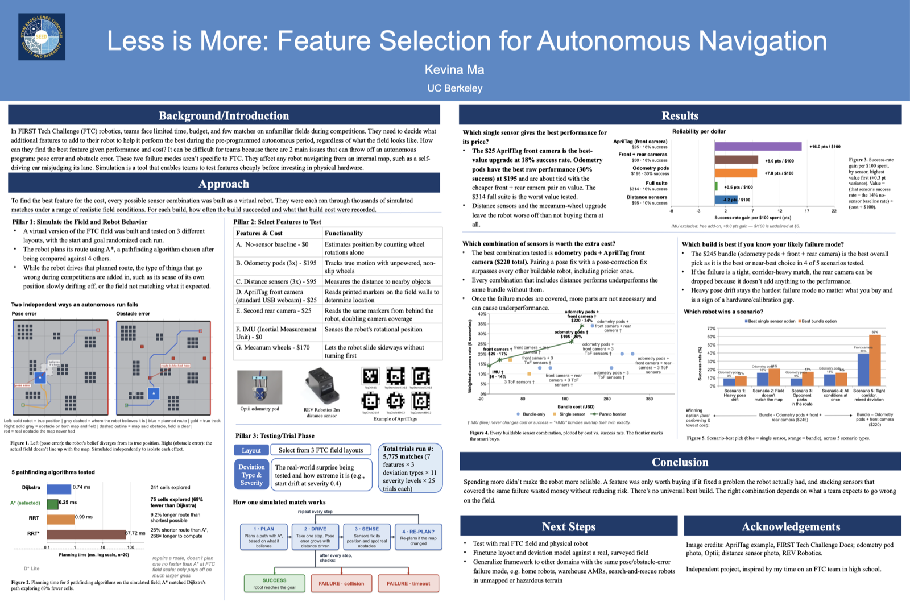
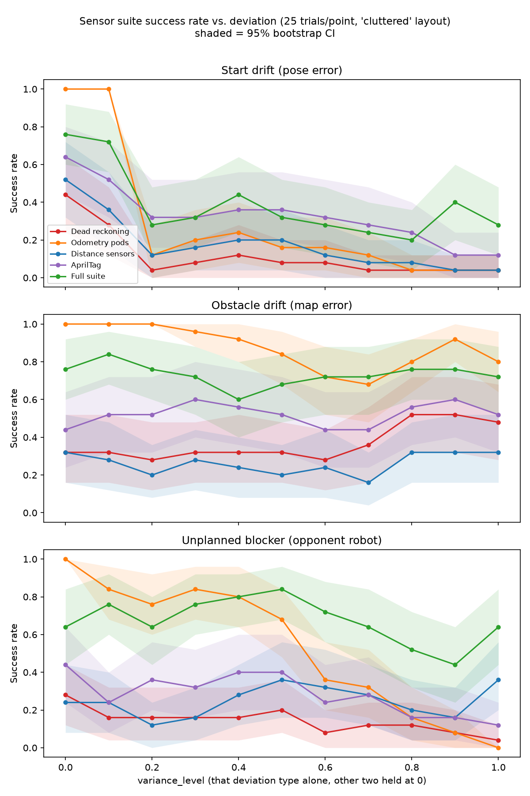

# autonomous-nav

### Less is More: Feature Selection for Autonomous Navigation

[](https://github.com/k-mma/autonomous-nav/actions/workflows/tests.yml)

**A pathfinding and sensor-strategy testbed for *FIRST* Tech Challenge (FTC)
robotics.** Five path-planning algorithms (Dijkstra, A\*, RRT, RRT\*, D\* Lite)
sit under a belief-planning and sensor-fusion layer that runs thousands of
controlled, repeatable autonomous-period trials — the statistical power a real
FTC season's ~10 matches can never supply — to answer one question: **which
sensors are actually worth the money, and when?**


Four sensor suites driving the *identical* seeded 30-second match, in real
time (`pygame_app/scenarios/scenario_ftc_suites.py`). The gray outline behind
each robot is where it *believes* it is; the gap is accumulated pose error.
AprilTag's camera FOV is the blue cone, the distance suite's three ToF cones
are the tan wedges — that visible coverage gap is the geometry behind the
fourth headline result below. This is one scenario, not a ranking: the
aggregate over 5,775 matches is in [Results](#results).

## Headline results

- **A\* explores 68.9% fewer cells than Dijkstra** for the identical optimal
  path — 241 vs. 75 cells on average across 20 random 25x25 grids.
- **The "obviously better" fix backfires.** Naively merging AprilTag +
  odometry pods looks good (35% success), but a real confidence-weighted
  fusion of those same two sensors *drops* it to 22% — below odometry alone
  (25%). More sensors, fused more carefully, made the robot less reliable.
- **Best value is not best performance.** A $25 AprilTag webcam returns 32x
  the success-rate gain per dollar of the $314 "buy everything" bundle
  (+16.0 vs. +0.5 points per $100), even though odometry pods alone post the
  highest raw success rate (30%).
- **A "safe-looking" sensor can be the worst buy.** The 3-sensor distance
  suite collides in 77% of trials even at *zero* field deviation: its cones
  cover only ~75° of the 360° around the robot, a geometry problem no amount
  of field accuracy fixes.

Numbers and 95% bootstrap CIs behind each claim: [Results](#results) below,
`benchmark_results/ftc_suite_writeup.md`, and [VALIDITY.md](VALIDITY.md).

## Poster

The one-page version of everything here, built for a research symposium at
UC Berkeley.

[](docs/poster.pdf)

**[Full-size PDF →](docs/poster.pdf)**

## Quickstart

Python 3.11+.

```bash
python3 -m venv nav-env
source nav-env/bin/activate
pip install -r requirements.txt
```

```bash
python3 pygame_app/main.py       # interactive visualizer (screenshot above)
python3 -m ftc.suite_benchmark   # regenerate the headline study (~1 min)
python3 -m ftc.recommend         # "which sensors should I buy" decision CLI
python3 -m ftc.optimizer         # which COMBINATION of sensors to buy
```

```bash
pip install -r requirements-dev.txt   # adds pytest
python3 -m pytest                     # CI runs this on every push
```

Preset scenarios, the PyBullet 3D demos, and every side-study benchmark are in
[WRITEUPS.md's command reference](WRITEUPS.md#command-reference). If `pip
install` fails building `pybullet` from source (common on very new
macOS/Xcode), the one-line fix is in WRITEUPS.md's "A build problem worth
documenting".

### Visualizer controls

| Key / click | Action |
|---|---|
| Left-click | Toggle obstacle |
| Shift + Left-click | Place/remove a moving obstacle |
| Right-click / Shift + Right-click | Place start / goal |
| `D` / `A` / `R` | Switch algorithm (Dijkstra / A\* / RRT) |
| Space | Run the active algorithm |
| `W` | Start/stop the robot walking the path |
| `H` | Cycle A\*'s heuristic |
| `X` | Toggle 8-directional movement |
| `M` / `K` / `S` / `C` | New maze / cost map / lidar sensor / clear |

## The research question

FTC autonomous is a 30-second dash: drive from a known start to a scoring
position on a pre-programmed route, with no driver input. Every team already
senses *something* — at minimum, motor encoders — and can buy more: odometry
pods, distance sensors, AprilTag vision, or all three. Each costs real money
and integration time.

Which one is worth it isn't obvious from specs, because the answer depends on
*which kind* of deviation shows up on a given field. A robot that starts a few
inches off its mark needs pose correction, not obstacle sensing; a field whose
elements don't match the CAD, or an opponent parked somewhere unplanned, needs
the opposite. These are two different failure modes with two different fixes,
not one generic "uncertainty" axis.

A team gets roughly 10 matches a season — one noisy, unrepeatable trial each,
no ground truth, no control over how far reality deviates from what the
routine assumed. That is not enough data to answer this empirically, no matter
how many matches they play. That's the actual thesis here: simulation is the
only viable instrument for this question, not a stand-in for hardware you'd
use if you had more of it.

`ftc/suite_benchmark.py` sweeps 7 sensor suites (`ftc/sensors.py`) against 3
independently-scaled deviation types (`nav/field_variance.py`) at 11 deviation
levels on a real 30-second budget (`ftc/match.py`) — 5,775 matches, in about a
minute.

## Results

25 trials x 7 suites x 3 deviation types x 11 levels, on the "cluttered" field
layout. Full breakdown in `benchmark_results/ftc_suite_writeup.md`.



| Suite | Cost | Success rate (variance_level >= 0.3) |
|---|---:|---:|
| Odometry pods | $195 | 30% |
| AprilTag (front camera) | $25 | 18% |
| Rear camera | $50 | 18% |
| Full suite | $314 | 16% |
| Dead reckoning (baseline) | $0 | 14% |
| IMU | $0 | 14% |
| Distance sensors | $95 | 10% |

Odometry pods wins on raw success rate; AprilTag wins on value by a wide
margin (+16.0 points per $100 over the free baseline, vs. the full suite's
+0.5 — a 32x gap). The suites the full bundle stacks on top run into
diminishing returns rather than each adding its standalone value again. Every
cost is a real, currently-listed vendor price (REV Robotics, Optii, Logitech);
see `ftc/config.py`'s per-constant source comments.

**The most useful result is negative.** The distance-sensor suite collides in
77% of trials at *zero* field deviation. About two-thirds of those persist
with pose drift forced to zero — the cause isn't drift, it's that 3 ToF cones
at ~12.5° half-angle cover only ~75° of 360°. `ftc/coverage_benchmark.py`
shows this is structural: sweeping up to 8 sensors (the most this project
prices as legal FTC hardware) still leaves a 160° blind arc. Buying distance
sensors without covering the perimeter can be worse than not sensing at all.

### Which combination to buy

The table above compares fixed suites; a team's real question is a shopping
question. `ftc/bundle.py` composes suites into one working suite — costed over
the **union of their parts**, which is what reduces 63 raw combinations to 23
genuinely distinct robots — and `ftc/optimizer.py` searches that space.


This ran over two scenario catalogs, and they name different robots — worth
being explicit about, because the difference is the point rather than a
discrepancy:

| | Baseline catalog | Match-realistic catalog |
|---|---|---|
| Profiles / trials | 5 x 25 (2,875 matches) | 5 x 90 (10,350 matches) |
| Fidelity | optimistic | realistic |
| **Best average** | odometry + front camera ($220, 34%) | odometry + front + rear camera ($245, 26%) |
| **Best worst-case** | encoders only ($0, 0%) | odometry + front + rear camera ($245, 12%) |
| Writeup | `ftc_optimizer_writeup.md` | `ftc_optimizer_match_writeup.md` |

The match-realistic catalog is the one to trust for a purchasing decision: it
runs at realistic fidelity with mixed deviation axes per scenario, and there
best-average and most-robust name the *same* robot, so there's no tradeoff to
weigh. The optimistic catalog's headline $220 robot is the cheaper answer to an
easier question.

Per scenario (chart above, right), the $245 bundle wins four of the five and
the $220 bundle takes the tight-corridor case — so the rear camera earns its
$25 everywhere except the one layout where there is no room to use it.

Either way the cheapest *significant* upgrade is the same: adding AprilTag to
odometry pods, +8.8% (95% CI [+4.0%, +14.4%], p<0.001) for $25.

Because every candidate runs the *identical* seeded scenarios, "is this bundle
better?" is answered with a **paired** bootstrap, not by checking whether two
independent CIs overlap. That distinction is not cosmetic: two candidates whose
independent CIs overlap heavily (20-50% vs. 35-65%) can have a paired
difference of [+5.0%, +27.5%], p=0.004.

Two findings worth stating plainly:

- **Bundling works, but only across capability categories.** Every bundle that
  significantly beat its own best single component spans more than one
  category (pose fixing / obstacle sensing / drift reduction / heading
  holding) *and* adds one that component lacked. Two sensors fixing the same
  failure mode don't stack. Buy across failure modes, not the two best sensors.
- **Greedy reasoning happens to work here.** On the baseline catalog, forward
  selection lands on the same robot as exhaustive search: from odometry pods
  (26%, $195), its one addition — AprilTag — is itself significant (p<0.001),
  and nothing further is worth adding.

## Threats to validity

Naming these plainly is what separates a research testbed from a demo. Full
mechanism, numbers, and CIs for all 12 are in [VALIDITY.md](VALIDITY.md);
the three that most constrain the headline result:

- **Synthetic ground truth.** Every trial's "ground truth" is a procedurally
  perturbed copy of the assumed map, not a measurement of a real field — a
  hypothesis about what deviation matters, not a validated one.
  [Detail](VALIDITY.md#synthetic-ground-truth)
- **Camera FOV and heading error.** Every number above assumes the
  `"optimistic"` fidelity tier (omnidirectional camera, perfect heading). The
  best-value suite does *not* survive the first step off it — it flips from
  AprilTag to Odometry pods at "realistic".
  [Detail](VALIDITY.md#camera-fov-heading-error)
- **No sensor-fusion conflict.** Bounded for AprilTag vs. odometry pods, open
  for every other pairing — this is the fusion reversal in the headline
  results above. [Detail](VALIDITY.md#sensor-fusion-conflict)

## How it fits together

`nav/` is a domain-neutral belief-planning library — grid, planners, sensor
and occupancy models, benchmarks — with no FTC-specific identifiers anywhere
in it. `ftc/` is a separate package holding the domain specialization (an 18in
robot, a 144in field, a 30-second clock, AprilTags). Keeping the boundary at
the package level, rather than scattering FTC `if` branches through `nav/`, is
what lets the core stay reusable for a different robot, field, or competition.

```
nav/           Framework-agnostic core: grid, planners, sensor/occupancy
               models, field variance, policies, stats, benchmarks
ftc/           FTC domain layer: field, sensor suites, match model, the
               headline study, bundle optimizer, decision CLIs
pygame_app/    2D interactive visualizer + preset scenarios
pybullet_app/  3D port: single-robot, multi-robot, and CBS demos
benchmark_results/  Generated CSVs, plots, and writeups
docs/          Symposium poster
```

Neither app directory is named literally `pygame` or `pybullet` — a directory
with that exact name on `sys.path` would shadow the real installed library.
The file-by-file tree is in
[WRITEUPS.md](WRITEUPS.md#repo-layout-the-full-annotated-tree).

### Planners

Every planner is a backend `nav/algorithms.py`'s `find_path` can swap in, but
`ftc/` uses A\* exclusively — and the reason is a completeness argument, not a
speed one. Dijkstra and A\* are resolution-complete (guaranteed to find a path
at the grid's resolution if one exists); RRT is only probabilistically
complete (guaranteed as sample count → ∞, not at any fixed budget).
`nav/scale_benchmark.py` shows that gap as measured incompleteness as grids
grow:


| Size | Dijkstra | A\* | RRT (k-d tree) | RRT found path |
|---:|---:|---:|---:|---:|
| 20x20 | 0.465ms | 0.227ms | 0.443ms | 8/8 |
| 50x50 | 2.679ms | 0.762ms | 1.520ms | 8/8 |
| 100x100 | 9.732ms | 1.156ms | 15.162ms | 7/8 |
| 200x200 | 56.511ms | 9.968ms | 58.548ms | **5/8** |

A 100x increase in cells grows Dijkstra's runtime ~120x but A\*'s only ~44x.
`nav/kdtree.py`'s spatial index made RRT faster than Dijkstra at every size
above (it used to be 620x slower) — but the completeness gap is untouched by
that, which is the point. RRT/RRT\* stay in the repo as measured baselines for
*why* an exhaustive heuristic search wins here, not as something `ftc/` should
reach for. `nav/rrt_star.py` and `nav/dstar_lite.py` (measured against fresh
A\* in `nav/replan_benchmark.py`) round out the set.

`pybullet_app/` ports the identical `nav.grid.Grid` into 3D and plans with the
same unmodified `find_path`: a Husky driven by velocity control along a
spline-smoothed route, a real raycast lidar (`pybullet.rayTestBatch`, 48 rays)
that replans on discovery, a two-robot corridor conflict, and an N-robot
intersection coordinated by `nav/cbs.py`'s Conflict-Based Search. Mechanics,
build stories, and the bugs found along the way are in
[WRITEUPS.md](WRITEUPS.md).

## Further reading

- **[WRITEUPS.md](WRITEUPS.md)** — algorithm mechanics, the admissibility
  argument, cost map and sensor model design, the PyBullet port, sweep
  parallelization, the full repo tree, and the command reference.
- **[VALIDITY.md](VALIDITY.md)** — all 12 threats to validity, each with its
  mechanism, numbers, and current status.
- **`benchmark_results/`** — every study's raw CSV, plot, and writeup.

---

Independent project, inspired by my time on an FTC team in high school.
